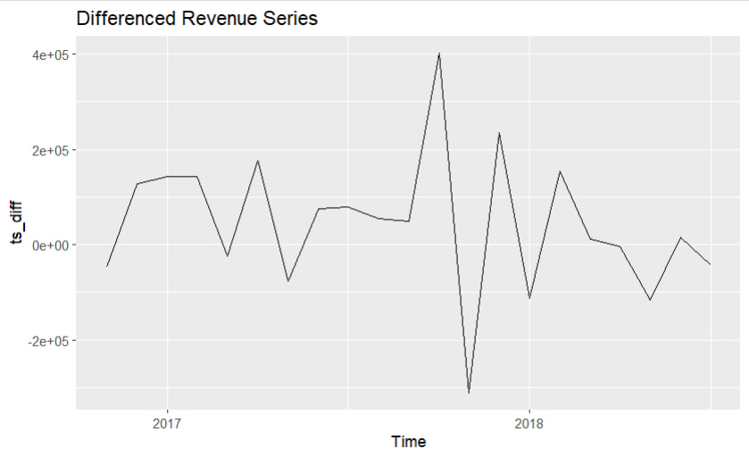
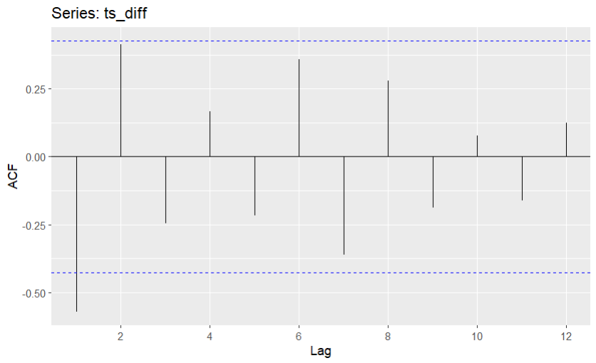
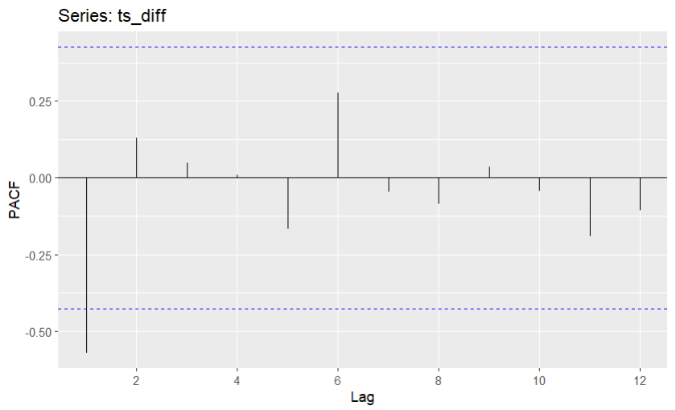
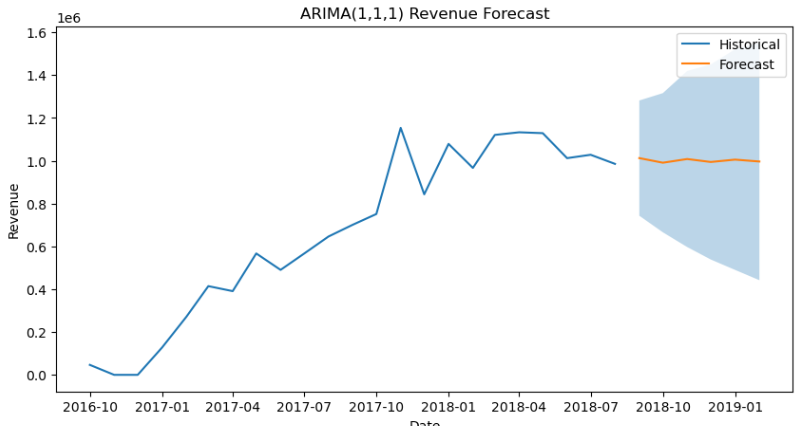
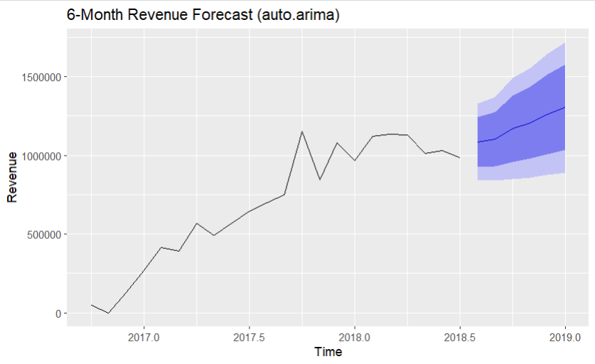
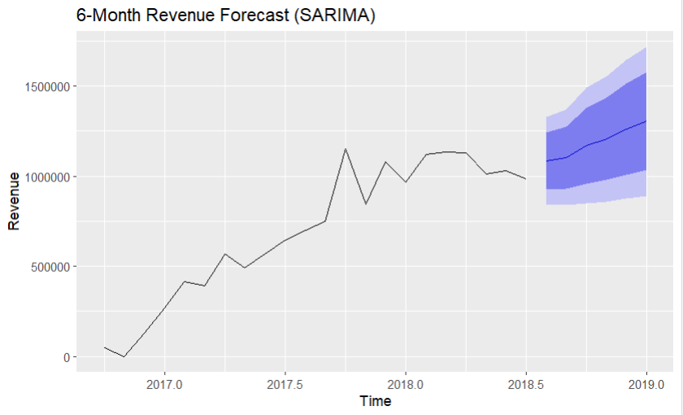
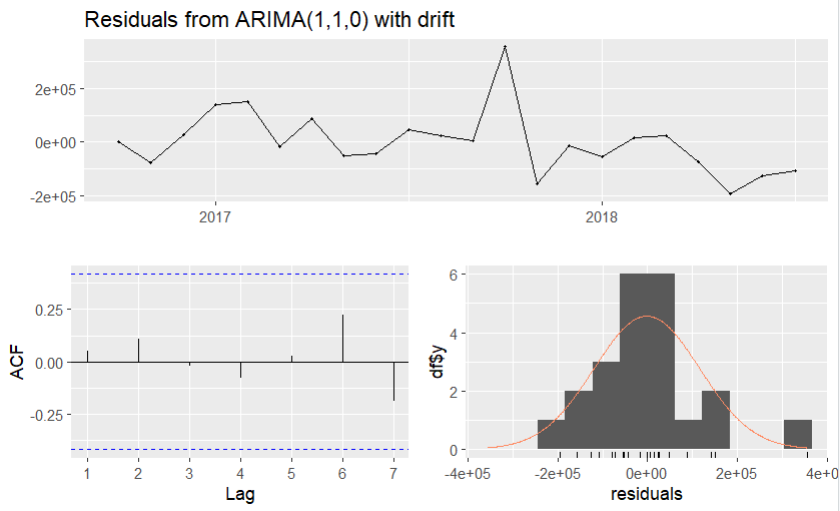
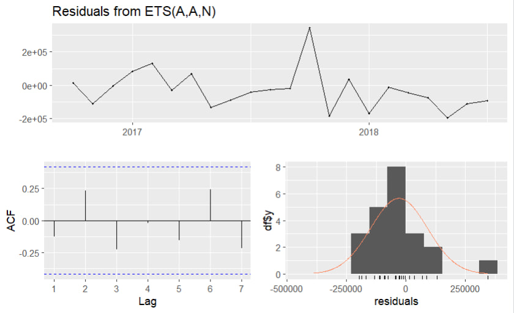
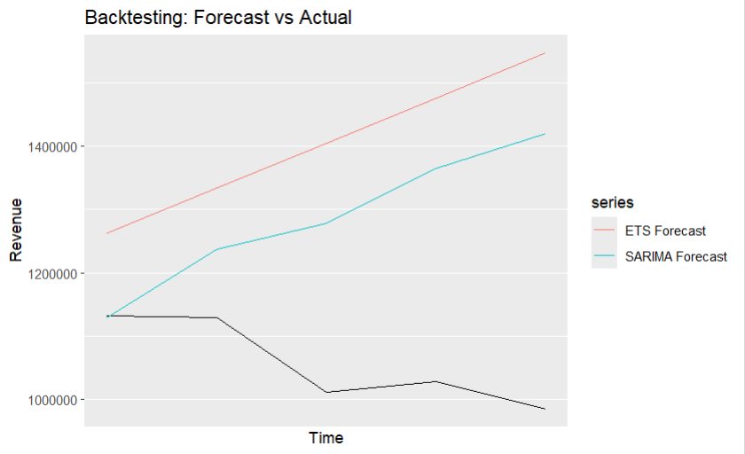

# Financial Time Series Forecasting (ARIMA / SARIMA / ETS)

This project demonstrates an end-to-end time series forecasting pipeline for business revenue data, combining Python for data preprocessing and R for statistical time series modeling.

The goal is to simulate a realistic analytics workflow, where raw transactional data is transformed into a clean time series and used for forecasting with classical econometric models commonly applied in business and finance.

---

## Project Overview

**Key objectives:**
- Build a clean monthly revenue time series from transactional data
- Test stationarity and apply differencing
- Compare multiple forecasting models:
  - ARIMA
  - SARIMA
  - ETS (Exponential Smoothing)
- Perform backtesting and model comparison
- Produce interpretable forecasts suitable for business decision-making

---

## Tools & Technologies

- **Python**: pandas, numpy, statsmodels, matplotlib  
- **R**: ggplot2, dplyr, readr, lubridate, forecast, tseries 
- **Methods**: ADF test, ARIMA, SARIMA, ETS, backtesting  
- **Data source**: Brazilian E-Commerce Public Dataset (Olist)

---

## Dataset Overview

The project uses the **Olist Brazilian E-Commerce Public Dataset**, which represents real transactional data from a large online marketplace.

The dataset includes:

- ~100,000 orders
- Customer, seller, product, and geolocation data
- Order lifecycle timestamps (purchase, approval, delivery)
- Payment values and installment information
- Product categories (translated to English)

For this project, the dataset was used to **reconstruct historical revenue**, reflecting how raw operational data is typically handled in real companies rather than working with a pre-aggregated time series.

**Original dataset (Kaggle):**  
https://www.kaggle.com/datasets/olistbr/brazilian-ecommerce

---

## Data Availability

Due to file size limitations, raw CSV files are not stored directly in this repository.

**Raw datasets (Google Drive):**  
https://drive.google.com/drive/folders/1FeDjNPot8-LrITfVb58msrz1AUJUPZaT

**Processed dataset used for modeling:**
data/processed/monthly_revenue.csv
This file contains a clean, ordered monthly revenue time series and serves as the input for all forecasting models.

## Workflow Summary

### Python (Data Preparation & Baseline Modeling)

- Merge multiple transactional tables
- Calculate order-level revenue
- Aggregate revenue to monthly frequency
- Construct a time index
- Test stationarity using the **ADF test**
- Apply differencing to achieve stationarity
- Explore a baseline ARIMA model

### R (Forecasting & Validation)

- Import processed monthly revenue data
- Convert data into a time series object
- Automatically select model parameters using auto.arima
- Fit **SARIMA** and **ETS** models
- Analyze residuals (ACF, distribution, independence)
- Perform backtesting and compare model accuracy

---

### Forecast Model Comparison

| Model   | RMSE     | MAE      |
|--------|----------|----------|
| SARIMA | **114,822** | **81,631** |
| ETS    | 120,492  | 91,425  |

**Key insights:**

- Both models successfully captured the **overall revenue trend**
- **SARIMA achieved lower error metrics**, indicating better predictive accuracy
- ETS produced smoother forecasts but handled variance less effectively
- SARIMA was selected as the **final model** due to stronger backtesting performance

---

## Example Outputs

### Stationarity Check and Differencing

The original monthly revenue series exhibited a clear upward trend, violating the stationarity assumption required for ARIMA-family models.
After applying first-order differencing, the series fluctuates around a stable mean with reduced trend effects, indicating that the data is suitable for ARIMA/SARIMA modeling.

This step was crucial to ensure valid parameter estimation and reliable forecasts.

### Autocorrelation Function (ACF)

The ACF plot of the differenced monthly revenue series is used to identify potential moving average (MA) components.  
Most autocorrelations lie within the confidence bounds, indicating that first-order differencing was sufficient to achieve stationarity.

### Partial Autocorrelation Function (PACF)

The PACF plot helps identify potential autoregressive (AR) terms.  
A significant spike at lag 1 supports the inclusion of a low-order AR component in the ARIMA model.

### Python – Baseline ARIMA Forecast

A baseline ARIMA(1,1,1) model was fitted in Python to validate stationarity assumptions and provide an initial forecast.  
While the model captures the overall trend, wide confidence intervals indicate increasing uncertainty over the forecast horizon.

### R – auto.arima Forecast

The auto.arima function automatically selected an ARIMA(1,1,0) model with drift based on AIC criteria.  
This model provided a strong statistical baseline for comparison with more complex seasonal models.

### R – SARIMA Forecast

The SARIMA model explicitly accounts for seasonal structure in the monthly revenue data.  
Compared to non-seasonal ARIMA, SARIMA produced more stable forecasts and narrower confidence intervals.

### SARIMA Model – Residual Diagnostics (using auto.arima)

Residuals from the SARIMA model show no significant autocorrelation and approximate normality.  
This confirms that SARIMA adequately captures both trend and seasonal components of the
series.

### ETS Model Residual Diagnostics

Residual diagnostics for the ETS(A, A, N) model show that while the residuals are centered around zero, they exhibit noticeable variance spikes and mild autocorrelation.
These patterns indicate that the ETS model struggles to fully capture the underlying dynamics of the revenue series, particularly during periods of sharp revenue changes.

### Backtesting: Forecast vs Actual

Backtesting was performed to compare ETS and SARIMA forecasts against actual revenue values.  
SARIMA achieved lower RMSE and MAE, demonstrating superior performance in capturing temporal dynamics.

---

## Key Learnings

- The original monthly revenue series was **non-stationary**, which was confirmed by the ADF test.  
  After first-order differencing, the series became stationary and suitable for ARIMA-family models.

- ACF and PACF analysis of the differenced series suggested a **low-order AR and MA structure**, supporting the use of compact ARIMA configurations rather than high-order models.

- Auto.arima selected an **ARIMA(1,1,0) with drift**, indicating that revenue growth is driven primarily by a persistent trend component rather than short-term shocks.

- Seasonal patterns were present but **not strong enough to dominate the series**, which is why both ARIMA-based and ETS models were viable candidates.

- **SARIMA outperformed ETS** in backtesting, achieving lower RMSE and MAE:
  - SARIMA captured both the trend and short-term fluctuations more accurately
  - ETS produced smoother forecasts but tended to underreact to changes in variance

- Residual diagnostics for the SARIMA model showed:
  - No significant autocorrelation in residuals
  - Approximately symmetric residual distribution
  - Acceptable independence assumptions for forecasting

- Forecast uncertainty increased with the horizon, which was clearly reflected in the **widening confidence intervals**, emphasizing the importance of risk-aware interpretation in business forecasting.

- Model selection was based on **quantitative error metrics and residual behavior**, not visual fit alone, leading to a more robust and defensible forecasting choice.

## Business Interpretation

The forecasting results provide actionable insights for revenue planning and risk management.

• The SARIMA model captured both trend and seasonality, making it suitable for short- to medium-term financial planning.  
• Forecast confidence intervals widen over time, highlighting increasing uncertainty and the need for rolling re-forecasting in operational settings.  
• Compared to ETS, SARIMA showed lower forecast error (RMSE, MAE), indicating better robustness to revenue volatility.  
• Backtesting results suggest that seasonal patterns play a significant role in revenue dynamics and should be explicitly modeled. 

From a business perspective, these forecasts can support:

• Monthly budgeting and cash flow planning  
• Scenario analysis for revenue growth or slowdown  
• Early detection of deviations from expected performance

---

## Author

**Konstantin Rudnev**  
Aspiring Data Analyst / Business Analyst  
Open to opportunities across Europe

GitHub: https://github.com/Konstantin667
